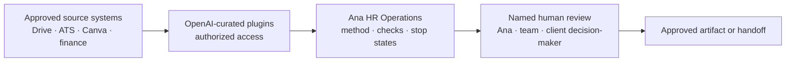

# Codex plugin stack for Ana's team

Ana HR Operations is the team's method layer. It defines the sequence, quality checks, privacy boundaries, approval gates, and human responsibilities. It does not need to duplicate integrations already available through the Codex Plugins Directory.

Codex plugins can provide reusable instructions and authorized connections to tools such as Google Drive, Gmail, Slack, and GitHub. Availability can vary by plan and workspace policy. The current official overview is [Find, install, and use plugins](https://learn.chatgpt.com/docs/plugins).

There is no documented OpenAI-curated HR or recruiting plugin that replaces Ana's operating method. The practical stack is:



The connector retrieves or prepares information. Ana HR Operations decides which SOP and gate apply. A named human makes the consequential decision.

## Start with the smallest useful stack

| Plugin | Use it for | Do not let it do by implication | Recommended for |
| --- | --- | --- | --- |
| **Google Drive** | Read an exact approved Doc or Sheet, copy a master, write to the approved destination, and re-read the result | Edit a master, search broadly across unrelated client folders, or move candidate records out of the ATS | Ana, coordinator, document operator |
| **Canva** | Open or copy the exact approved visual master and apply an approved content pack | Promote a generated candidate to a master or claim visual approval automatically | Ana, document operator |
| **Gmail** | Read a specifically authorized thread or prepare a draft after the engagement record is confirmed | Send, reply, or widen recipients without fresh approval | Ana and explicitly approved coordinator |
| **Google Calendar** | Read relevant availability or prepare a proposed event | Schedule, invite, reschedule, or cancel without fresh approval | Ana and explicitly approved coordinator |
| **Slack** | Retrieve named decisions or updates from an approved channel | Treat chat as final approval or search unrelated channels | Only teams that actually use Slack for delivery |
| **GitHub** | Review public-safe kit changes, issues, pull requests, releases, and validation | Store client/candidate data or become the daily delivery workspace | Ana and technical maintainers |
| **Codex Security** | Read-only security review of the plugin repository before release | Scan repositories the team does not own or replace release review | Technical maintainer |

Do not install every plugin for every person. Each teammate should connect only the accounts and tools required for their remit. Workspace administrators may restrict plugin installation and access.

## Install and connect

### Install Ana HR Operations

```powershell
codex plugin marketplace add frankxai/ana-ai-business-kit --ref main
codex plugin add ana-hr-operations@ana-business-kit
codex plugin list
```

After the marketplace is configured, [open Ana HR Operations in Codex](codex://plugins/ana-hr-operations@ana-business-kit). If the link is not activated by the browser or GitHub client, open **Codex → Plugins** and search for **Ana HR Operations**.

### Add curated plugins

Open the [OpenAI-curated Plugins Directory](codex://plugins/install/?marketplace=openai-curated) from the ChatGPT desktop app, or open **Codex → Plugins** manually. Install only the approved stack for the person's remit.

- [Google Drive](codex://plugins/google-drive@openai-curated)
- [Canva](codex://plugins/canva@openai-curated)
- [Gmail](codex://plugins/gmail@openai-curated)
- [Google Calendar](codex://plugins/google-calendar@openai-curated)
- [Slack](codex://plugins/slack@openai-curated)
- [GitHub](codex://plugins/github@openai-curated)
- [Codex Security](codex://plugins/codex-security@openai-curated)

Connect an individual company-approved account—never a shared login. Start a new Codex task after installing or reconnecting plugins so the current tools and skills load together.

## Teach the team through one safe rehearsal

Do not begin with a live client. Use the fictional [practice engagement](PRACTICE-ENGAGEMENT.md).

### Rehearse the operating method

> Use Ana HR Operations. Use fictional placeholders only. Name the SOP, entry criteria, source system, responsible person, approval gate, stop state, and expected receipt. Do not create, send, schedule, price, invoice, publish, or change a master.

### Rehearse Drive without changing a master

> Use Ana HR Operations and Google Drive. Use only the fictional practice folder I name. Locate the exact practice kickoff master, explain the copy route, and stop before creating or editing anything. Show the permission and approval needed for the next step.

### Rehearse an email handoff

> Use Ana HR Operations and Gmail. Use fictional details only. Prepare the recipient-and-revision approval card for SOP-07, then draft the email. Do not send it.

The rehearsal passes only when the operator can explain:

1. which system is authoritative;
2. what the connector may access;
3. which SOP governs the work;
4. which human decision is still required;
5. what the plugin must not do.

## Improve the method without losing control

Every improvement enters through one of two lanes:

| Change | Correct destination | Example |
| --- | --- | --- |
| Reusable and public-safe | Public kit issue or pull request | Clearer SOP wording, blank schema, fictional test, validation rule |
| Company-specific or private | Private overlay change | Real template link, approved pricing source, internal policy, client-specific route |

Use this loop:

1. **Capture:** the operator records the friction without client or candidate details.
2. **Classify:** the operations owner chooses public-safe kit or private overlay.
3. **Propose:** make one focused change with owner, reason, affected SOP, and expected result.
4. **Review:** Ana reviews the operating effect; the technical maintainer reviews code, permissions, and privacy.
5. **Validate:** run tests and the fictional engagement.
6. **Release:** merge, tag or publish the update, and write a short changelog.
7. **Adopt:** upgrade deliberately, start a new task, rehearse, then approve one bounded live pilot.

Team members should not edit installed plugin files directly. They propose a change through GitHub or the private overlay, then everyone receives the reviewed version through the marketplace update flow.

## What each Codex surface is for

| Surface | Best use here |
| --- | --- |
| **ChatGPT desktop app → Codex** | Local plugin-guided work, repository maintenance, document preparation, and review |
| **ChatGPT Work** | Tasks using connected sources and workspace-approved plugins without requiring a local Git checkout |
| **Codex CLI** | Technical installation, validation, release checks, and repository work |
| **GitHub** | Public-safe source, change proposals, pull requests, tests, releases, and changelog |
| **Private Drive / ATS / finance systems** | Live engagement, candidate, template, approval, and commercial records |
| **Scheduled tasks** | A reviewed recurring prompt using available plugins; never a substitute for human approval |

Scheduled tasks can use plugins and skills, but they do not make a sensitive workflow autonomous. Test the prompt in a normal task first, keep permissions narrow, and return a decision card instead of sending or changing records.

## Official references

- [Find, install, and use plugins](https://learn.chatgpt.com/docs/plugins)
- [Build plugins and curated marketplaces](https://learn.chatgpt.com/docs/build-plugins)
- [Build and share skills](https://learn.chatgpt.com/docs/build-skills)
- [Codex Security plugin](https://learn.chatgpt.com/docs/security/plugin)
- [GitHub permission and fork visibility](https://docs.github.com/en/pull-requests/collaborating-with-pull-requests/working-with-forks/about-permissions-and-visibility-of-forks)
